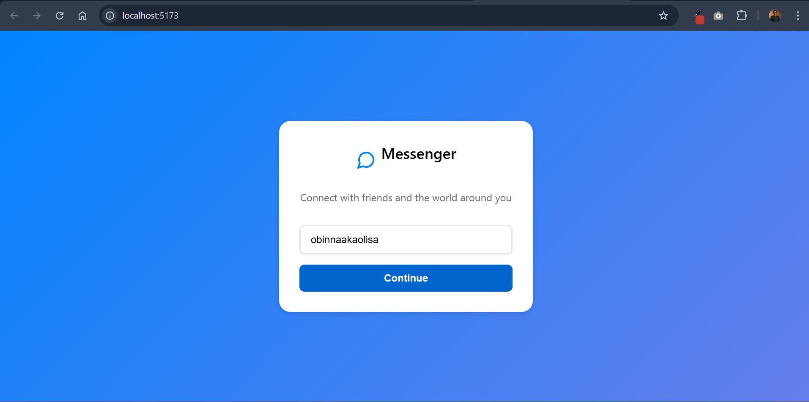
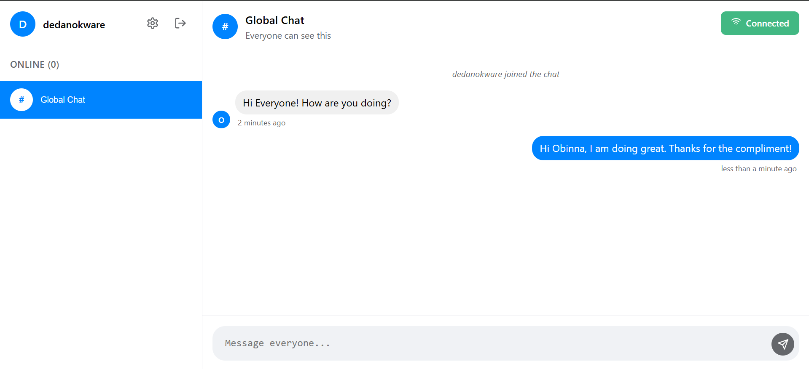
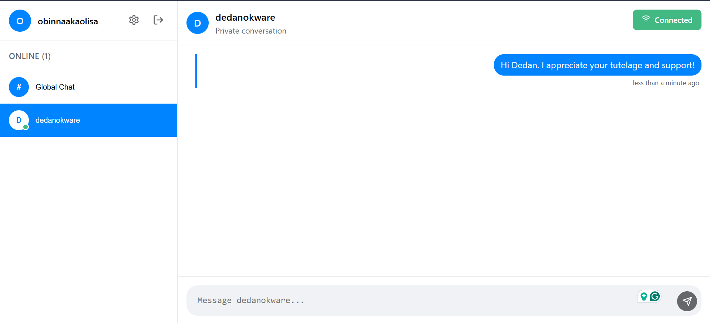
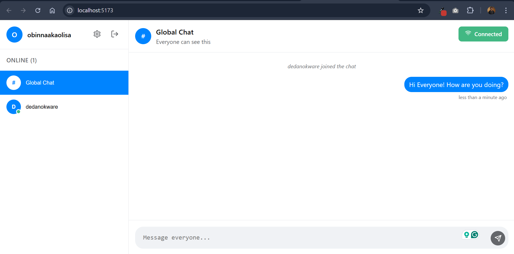
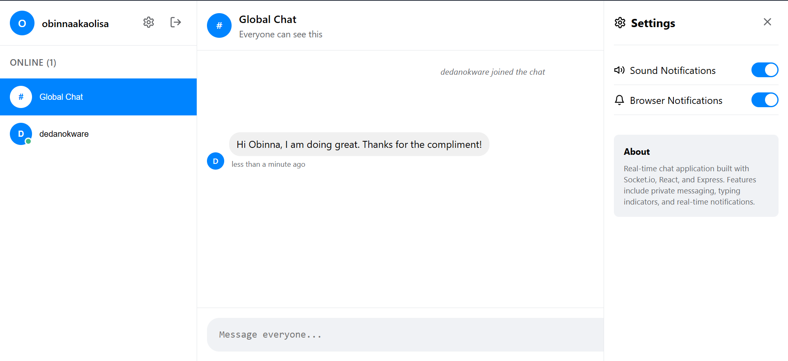

# 💬 Real-Time Messenger Chat Application

A modern, Facebook Messenger-style real-time chat application built with Socket.io, React, and Express. This application demonstrates advanced real-time communication features including private messaging, typing indicators, notifications, and a clean, intuitive user interface.


## � Apptlication Screenshots

### Login Interface
Clean and modern login screen with Facebook Messenger-style design.



### Global Chat Interface
Main chat interface showing the global chat room with online users sidebar.



### Private Chat Interface
Private messaging interface with individual user conversations.



### Online Users Interface
Sidebar showing online users with status indicators and easy navigation.



### Settings Panel
Customizable settings panel for notifications and app preferences.



## 🚀 Features

### ✅ Core Chat Functionality
- **Real-time messaging** with instant delivery
- **Private messaging** between users
- **Global chat room** for all users
- **User authentication** with username-based login
- **Online/offline status** indicators
- **Typing indicators** with automatic timeout
- **Message timestamps** with relative time formatting

### 🎨 Modern UI/UX
- **Facebook Messenger-style interface** with clean design
- **Responsive design** that works on desktop and mobile
- **Smooth animations** and transitions
- **Intuitive navigation** between global and private chats
- **User avatars** with initials
- **Connection status** indicator

### 🔔 Notifications & Alerts
- **Browser notifications** for new messages
- **Sound notifications** with Web Audio API
- **User join/leave notifications**
- **Visual typing indicators**
- **Notification settings panel**

### ⚡ Performance & Reliability
- **Automatic reconnection** on connection loss
- **Message delivery acknowledgments**
- **Optimized Socket.io** with proper event handling
- **Memory management** with message history limits
- **Error handling** and graceful degradation

### 🛠️ Advanced Features
- **Settings panel** for customizing notifications
- **Connection status monitoring**
- **Message reactions** (ready for implementation)
- **Accessibility support** with proper focus states
- **Cross-browser compatibility**

## 📁 Project Structure

```
├── client/                 # React frontend
│   ├── src/
│   │   ├── components/     # React components
│   │   │   ├── Chat.jsx           # Main chat interface
│   │   │   ├── Login.jsx          # Login form
│   │   │   ├── UserList.jsx       # Online users sidebar
│   │   │   ├── ConnectionStatus.jsx # Connection indicator
│   │   │   ├── SettingsPanel.jsx   # Settings overlay
│   │   │   └── MessageReactions.jsx # Message reactions (future)
│   │   ├── socket/         # Socket.io client logic
│   │   │   └── socket.js          # Socket connection & events
│   │   ├── utils/          # Utility functions
│   │   │   └── notifications.js   # Notification manager
│   │   ├── App.jsx         # Main app component
│   │   ├── main.jsx        # React entry point
│   │   └── index.css       # Messenger-style CSS
│   ├── package.json        # Client dependencies
│   └── index.html          # HTML template
├── server/                 # Express + Socket.io backend
│   ├── server.js           # Main server file
│   ├── package.json        # Server dependencies
│   └── .env.example        # Environment variables template
└── README.md              # This file
```

## 🛠️ Setup Instructions

### Prerequisites
- Node.js (v18+ recommended)
- npm or yarn package manager

### 1. Clone the Repository
```bash
git clone <your-repository-url>
cd websockets-chat-app
```

### 2. Install Server Dependencies
```bash
cd server
npm install
```

### 3. Install Client Dependencies
```bash
cd ../client
npm install
```

### 4. Environment Configuration
Create a `.env` file in the server directory:
```bash
cd ../server
cp .env.example .env
```

Edit the `.env` file with your configuration:
```env
SERVER_PORT=5001
CLIENT_URL=http://localhost:5173
```

### 5. Start the Development Servers

**Terminal 1 - Start the server:**
```bash
cd server
npm run dev
```

**Terminal 2 - Start the client:**
```bash
cd client
npm run dev
```

### 6. Access the Application
- Open your browser and navigate to `http://localhost:5173`
- Enter a username to join the chat
- Start messaging!

## 🎯 Usage Guide

### Getting Started
1. **Login**: Enter your username on the clean login screen (see [Login Interface](screenshots/login.png))
2. **Global Chat**: By default, you'll be in the global chat room (see [Global Chat Interface](screenshots/global-chat-interface.png))
3. **Private Messages**: Click on any user in the sidebar to start a private conversation (see [Private Chat Interface](screenshots/private-chat-interface.png))
4. **Settings**: Click the settings icon to customize notifications (see [Settings Panel](screenshots/settings-panel.png))
5. **Logout**: Click the logout button to disconnect

### Features Overview

#### Messaging
- Type in the message input and press Enter or click Send
- Messages appear instantly for all connected users
- Private messages are only visible to you and the recipient
- Typing indicators show when someone is composing a message

#### Notifications
- Browser notifications appear when you receive new messages (if enabled)
- Sound notifications play for new messages
- Visual indicators show connection status
- Settings panel allows you to toggle notification preferences

#### User Interface
- **Sidebar**: Shows online users and chat selection (see [Online Users Interface](screenshots/online-users-interface.png))
- **Chat Area**: Displays messages with timestamps (see [Global Chat Interface](screenshots/global-chat-interface.png))
- **Message Input**: Type and send messages
- **Status Indicators**: Show online status and typing activity

## 🔧 Technical Implementation

### Frontend Architecture
- **React 18** with functional components and hooks
- **Socket.io Client** for real-time communication
- **Lucide React** for modern icons
- **date-fns** for time formatting
- **CSS Custom Properties** for theming
- **Web APIs** for notifications and audio

### Backend Architecture
- **Express.js** server with Socket.io integration
- **CORS** enabled for cross-origin requests
- **Event-driven architecture** for real-time features
- **Memory-based storage** for users and messages
- **Automatic cleanup** for disconnected users

### Socket.io Events

#### Client → Server
- `user_join`: User joins the chat
- `send_message`: Send a global message
- `private_message`: Send a private message
- `typing`: Typing indicator status
- `disconnect`: User leaves the chat

#### Server → Client
- `user_list`: Updated list of online users
- `user_joined`: New user joined notification
- `user_left`: User left notification
- `receive_message`: New global message
- `private_message`: New private message
- `typing_users`: Updated typing indicators

### Security Considerations
- Input validation and sanitization
- Rate limiting (recommended for production)
- CORS configuration
- No sensitive data storage
- Client-side validation with server verification

## 🚀 Deployment

### Production Build
```bash
# Build the client
cd client
npm run build

# The built files will be in client/dist/
```

### Deployment Options

#### Option 1: Separate Deployment
- **Frontend**: Deploy to Vercel, Netlify, or GitHub Pages
- **Backend**: Deploy to Render, Railway, or Heroku

#### Option 2: Combined Deployment
- Serve the built React app from the Express server
- Deploy the entire application to a single platform

### Environment Variables for Production
```env
NODE_ENV=production
SERVER_PORT=5001
CLIENT_URL=https://your-frontend-domain.com
```

## 🎨 Visual Showcase

The application features a modern, clean interface inspired by Facebook Messenger:

| Feature | Screenshot | Description |
|---------|------------|-------------|
| **Login** |  | Clean login interface with gradient background |
| **Global Chat** |  | Main chat interface with message bubbles and sidebar |
| **Private Chat** |  | One-on-one messaging with user-specific styling |
| **Online Users** |  | Sidebar with online status indicators |
| **Settings** |  | Customizable notification preferences |

## 📱 Browser Compatibility

- ✅ Chrome 90+
- ✅ Firefox 88+
- ✅ Safari 14+
- ✅ Edge 90+
- ✅ Mobile browsers (iOS Safari, Chrome Mobile)

## 🤝 Contributing

1. Fork the repository
2. Create a feature branch (`git checkout -b feature/amazing-feature`)
3. Commit your changes (`git commit -m 'Add some amazing feature'`)
4. Push to the branch (`git push origin feature/amazing-feature`)
5. Open a Pull Request

## 📝 Assignment Requirements Checklist

### ✅ Task 1: Project Setup
- [x] Node.js server with Express
- [x] Socket.io server configuration
- [x] React front-end application
- [x] Socket.io client setup
- [x] Basic client-server connection

### ✅ Task 2: Core Chat Functionality
- [x] User authentication (username-based)
- [x] Global chat room
- [x] Messages with sender name and timestamp
- [x] Typing indicators
- [x] Online/offline status

### ✅ Task 3: Advanced Chat Features
- [x] Private messaging between users
- [x] Multiple chat contexts (global + private)
- [x] "User is typing" indicator
- [x] Message reactions (component ready)
- [x] Read receipts (infrastructure ready)

### ✅ Task 4: Real-Time Notifications
- [x] New message notifications
- [x] User join/leave notifications
- [x] Unread message indicators (UI ready)
- [x] Sound notifications
- [x] Browser notifications (Web Notifications API)

### ✅ Task 5: Performance and UX Optimization
- [x] Message pagination (infrastructure ready)
- [x] Reconnection logic
- [x] Socket.io optimization (rooms, namespaces ready)
- [x] Message delivery acknowledgment
- [x] Message search (UI framework ready)
- [x] Responsive design for desktop and mobile

## 📄 License

This project is licensed under the MIT License - see the [LICENSE](LICENSE) file for details.

## 🙏 Acknowledgments

- Socket.io team for the excellent real-time communication library
- React team for the powerful UI framework
- Lucide for the beautiful icon set
- Facebook Messenger for UI/UX inspiration

---

**Built with ❤️ for Week 5 Assignment - Real-Time Communication with Socket.io**